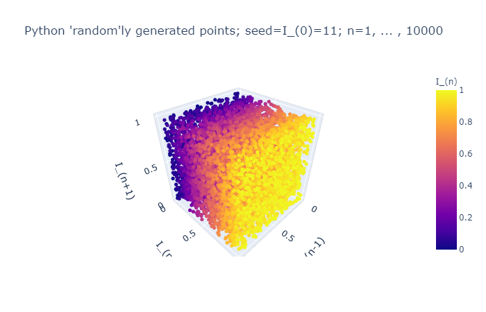
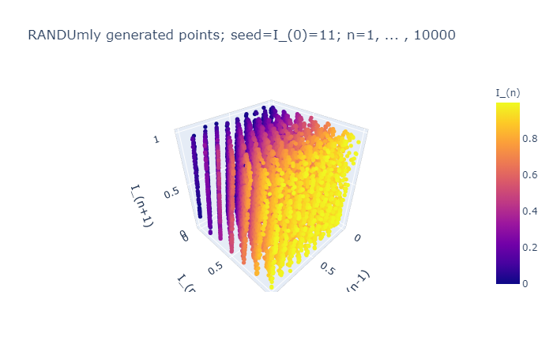

# MA402
Mathematics of Scientific Computing @ NCSU

Project 2: Experiments with Monte Carlo integration and quasi-random numbers.

The infamous RANDU generator was part of the Scientific Subroutine Package on IBM mainframe computers in the 1960's; the generator corresponds to:
  I_n+1 = (a * I_n + c) mod m; n = 0, 1, ...
with a = 65539, c = 0 and m = 2**31.

